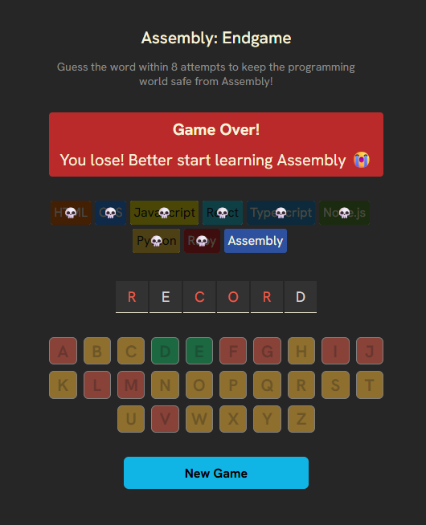
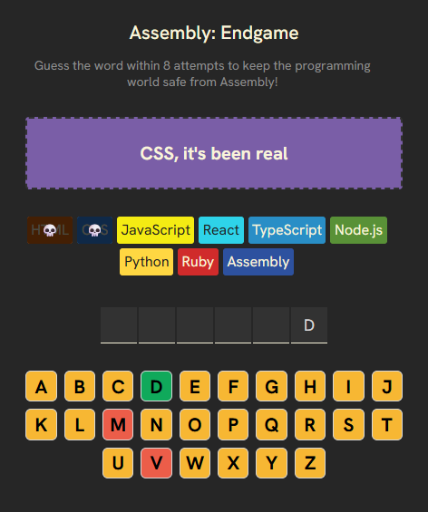
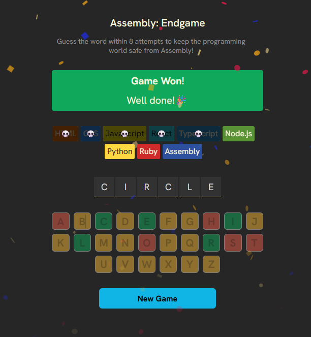

# Assembly: Endgame 🎮

A fun word guessing game built with React where you must save the programming world from Assembly by guessing the hidden word within **8 attempts**.

## 🚀 Live Gameplay

Guess the correct word letter by letter using the on-screen keyboard.

* ✅ Correct guesses reveal letters
* ❌ Wrong guesses eliminate programming languages
* ☠️ Each wrong attempt brings Assembly closer
* 🎉 Win by revealing the full word before all 8 attempts are used

---

## 📸 Screenshots

### Game Over Screen



### Gameplay



### GameWon



---

## 🛠️ Built With

* React
* Vite
* JavaScript
* CSS Grid & Flexbox
* clsx

---

## ✨ Features

* Responsive on-screen keyboard
* Dynamic game status messages
* Random farewell texts for eliminated languages
* Win/Loss game states
* Conditional styling using clsx
* Fully responsive UI
* Random word generation

---

## 📂 Project Structure

```txt
src/
│
├── Components/
│   ├── Keyboard.jsx
│   ├── Letters.jsx
│   ├── Programs.jsx
│   └── Status.jsx
│
├── utils/
│   ├── languages.js
│   ├── fareWellTexts.js
│   └── words.js
│
├── App.jsx
└── index.css
```

---

## ⚙️ Installation

Clone the repository:

```bash
git clone https://github.com/4chyuth-j/Word-end-game
```

Install dependencies:

```bash
npm install
```

Run the development server:

```bash
npm run dev
```

---

## 🎯 Future Improvements

* Add difficulty levels
* Add animations and sound effects
* Track score and streaks
* Add mobile keyboard support
* Add timer mode

---

